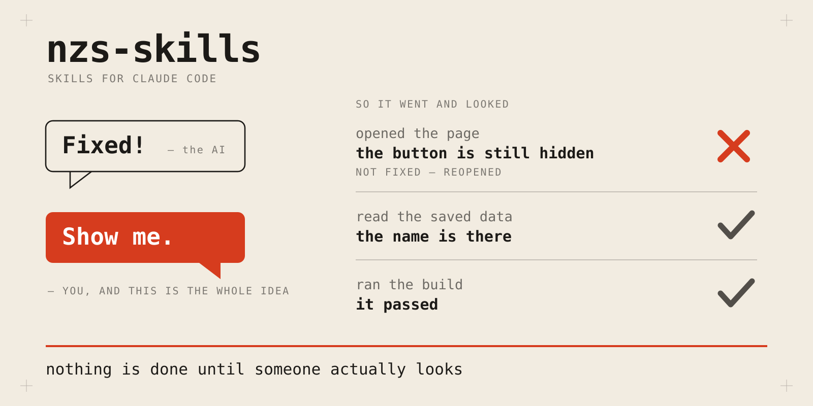
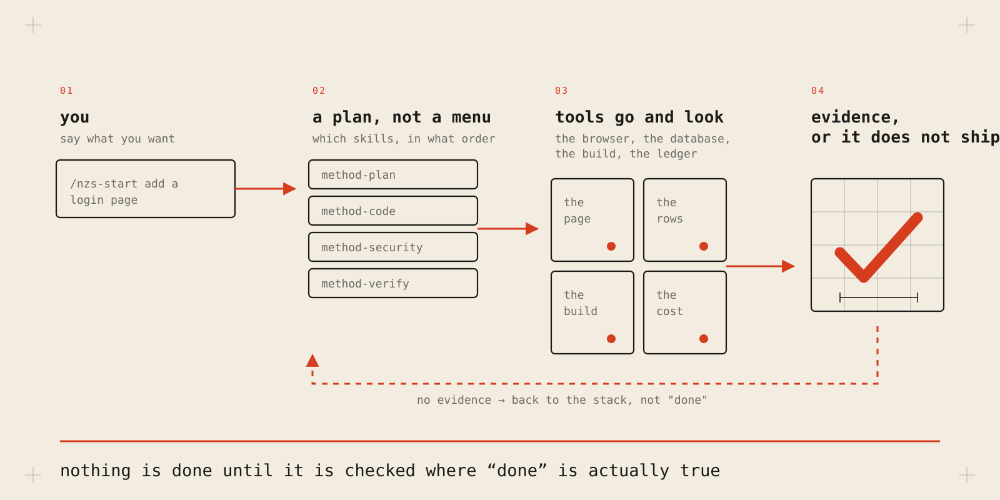

# nzs-skills

**English** · [ภาษาไทย](README.th.md)



[](https://github.com/neckttiie090520/nzs-skills/actions/workflows/validate.yml)
[](https://github.com/neckttiie090520/nzs-skills/stargazers)
[](https://github.com/neckttiie090520/nzs-skills/commits/main)
[](LICENSE)

Executable skills that stop your agent reporting work it did not do.

> **New here, or you vibecode rather than write code all day?**
> Read **[Start here](docs/START-HERE.md)** ([ภาษาไทย](docs/START-HERE.th.md))
> instead of this page. Fifteen minutes, no jargon, and you will have used it.

---

## Before / after

**Without this:**

```
you   make the save button visible on mobile
AI    Fixed! The button is now visible.
```

It was not. Nobody opened the page to look. You find out tomorrow, from a user.

**With this:**

```
you   make the save button visible on mobile
AI    Fixed!
you   show me
AI    Opened the page and looked. The button is still hidden
      behind the keyboard. Not fixed — reopening.
```

That is the whole product. The agent has to go and look before it is allowed to
say "done", and it tells you when it could not. Everything else here is that one
habit, applied to a specific kind of work.

These are not hypotheticals. Every rule here was bought with a real defect:

| what happened in the source project | the rule it became |
|---|---|
| A URL field split on the letter `s` — a lost backslash — live in production and **never worked once** | an edit that matches nothing and a probe that matches too much are the same failure |
| A dead regex made a repair pass fire on **every generation**, billed twice, result discarded | cost is read from the ledger, never from intention |
| Drafts came back at **13% of target length** under seven commits of interface polish | reviews rotate roles; one posture cannot see outside itself |
| Three edits **silently matched nothing** and were reported as done | a report is not evidence |

---

## Install

As a plugin, which keeps it updatable:

```
/plugin marketplace add neckttiie090520/nzs-skills
/plugin install nzs-skills@nzs-skills
```

Or copy the files, if you would rather read them first — and you should, because
these are instructions an agent follows on your machine:

```bash
git clone https://github.com/neckttiie090520/nzs-skills.git
cp -r nzs-skills/skills/* ~/.claude/skills/        # global
cp -r nzs-skills/skills/* .claude/skills/          # or per project
```

**Then restart Claude Code.** Skills, plugins and MCP servers are read at
startup; anything installed mid-session sits on disk unloaded. This is the step
that makes a correct install look broken.

Then, in any project:

```
/nzs-go I need to add rate limiting to the public API
```

The first run writes `.method/config.yml` via `method-groundwork`. Everything
project-specific lives there — commands, mediums, budgets, references, model
tiers — which is why **no skill in this repo names a framework, a database, or a
currency.**

---

## What you type

| command | when |
|---|---|
| **`/nzs-go`** | any time you are unsure. Returns the skill *stack* for the job, with an exit condition anyone can check |
| **`/nzs-huddle`** | a vague idea to resolve, or a decision to attack — seats a biased outsider, a hard-to-please CTO, and a senior who arbitrates. Never waits on you |
| **`/nzs-marathon`** | work too big for one sitting. Writes a `/goal` prompt and a plan file the loop re-reads, built to terminate |
| **`/nzs-setup`** | a fresh machine. Installs the environment and *proves* each piece works |
| **`/nzs-scrapbook`** | something worked, or broke. Records the *shape* of it into engram |
| **`/nzs-handoff`** | out of context, or stopping for the day |
| **`/nzs-crucible`** | throw everything at a change at once — scrutinize, bug-hunter, codex, then debug-mantra on any fix, one merged report |

Everything else the model reaches for on its own.

---

## How it works



1. **You ask.** Plain language, in any language.
2. **`nzs-go` returns a stack, not a menu.** A router that hands you three
   options has given the decision back to you.
3. **The skills send tools to look** — the live DOM for a rendered claim, real
   rows for a persistence claim, the ledger for cost, a command's exit code for
   a build.
4. **No evidence means back to the stack**, not "done". Anything that cannot be
   settled is reported as *attempted, unverified — and why*.

---

## The two layers

**Entry points.** You invoke these by name. They orchestrate.

| skill | what it does |
|---|---|
| **`nzs-go`** | returns the skill *stack* for a job, with an observable exit condition |
| **`nzs-marathon`** | writes a `/goal` prompt and the plan file a loop re-reads, built to terminate |
| **`nzs-huddle`** | resolves a shapeless request into an artifact, or judges a formed decision into a verdict — same three seats, agentic, never waits on you |
| **`nzs-setup`** | installs the whole environment and *proves* each piece works |
| **`nzs-handoff`** | compacts a session into something the next agent can resume from |
| **`nzs-scrapbook`** | records wins, mistake *shapes*, and your taste — into engram |
| **`nzs-crucible`** | runs scrutinize, bug-hunter and codex against the same diff, routes fixes through debug-mantra first, ends in one report |

**Disciplines.** The model reaches for these. One thing each, done properly.

| stage | skills |
|---|---|
| the rules | `method-rulebook` · `method-groundwork` |
| gather | `method-scout` · `method-mimic` · `method-distill` |
| decide | `method-greenlight` · `method-tab` · `method-logbook` · `method-autopsy` · `method-brief` · `method-fieldwork` · `method-longlist` |
| build | `method-blueprint` · `method-craft` · `method-tripwire` · `method-stress-test` |
| check | `method-gauntlet` · `method-whodunit` · `method-witness` · `method-sketch` |
| secure | `method-lockpick` · `method-lookout` · `method-vault` · `method-trapdoor` · `method-puppeteer` |
| ship | `method-launch` |
| run it all | `method-conductor` — drives a whole feature through the stages above |

A user-invoked skill may call a discipline. It never calls another user-invoked
skill — the rule that keeps triggers unambiguous.

---

## What it actually enforces

- **Evidence before assertion.** A fix reported from reading the diff is not a
  fix. Settle it in the DOM, the compiled artifact, the ledger, the rows.
- **A guard is born on the second occurrence** — and is not trusted until it has
  been *seen failing* on a real mutation and passing when restored.
- **Bounds never flatter.** A ceiling is not a forecast. Null is not zero. A
  displayed cost rounds up.
- **Declined work is recorded with its price**, so nobody re-derives it.
- **Budgets ratchet down only.** A raise needs a written reason in the diff.
- **Production is verified before the push that needs it**, not after.
- **Every control must be real.** No UI for behaviour the server does not have.

---

## The known weakness

The anti-theatre gate is **self-attested**. A model can tick its checkboxes and
paste invented command output; nothing external witnesses it. `nzs-huddle`'s Judge job is the closest thing to an external witness here, and it is not enough. Making the
independent reviewer's re-run mandatory for load-bearing claims is the open
design decision.

It is stated here rather than buried, because a method that hides its own weak
point has already broken its first rule.

---

## The repo holds itself to the method

A set that preaches executable guards and enforces nothing would be a
description of a discipline rather than the discipline. So:

```bash
node scripts/validate.mjs --verbose
```

No dependencies. It checks the frontmatter contract, that every cross-reference
resolves, that every entry point is reachable from the router and has a command,
that both READMEs cover the set, that no credential-shaped string is committed,
and that **no count is written into prose** — each because that exact defect
shipped here first. Every check has been mutation-tested: broken deliberately,
seen red, restored, seen green. CI runs exactly this and nothing else.

---

## It does not work alone

A skill decides **what counts as evidence**. A tool is **how you go and get it**.
`method-witness` says a rendered claim is settled in the DOM; Playwright is what
opens the browser. `nzs-scrapbook` says a lesson must outlive the session; engram is
what stores it.

**[The ecosystem guide](docs/ECOSYSTEM.md)** ([ภาษาไทย](docs/ECOSYSTEM.th.md))
covers every tool the method composes with — what each is, what it buys, how to
drive it, **where it fails** — plus named stances, use cases end to end, and the
case studies behind every rule.

Only tools a setup step can **install and then prove working** are listed.
Anything needing a human to open a browser and paste a key back is excluded, on
the same principle as everything else here: do not claim what you cannot check.

---

## Credit

This method stands on other people's work. Full list, with what each is used
*for*, in [the ecosystem guide](docs/ECOSYSTEM.md#credits). The load-bearing ones:

- [mattpocock/skills](https://github.com/mattpocock/skills) — the user-invoked /
  model-invoked split and the shared-language file, which is the structure of
  this whole repo. `nzs-huddle`'s Resolve job is adapted from his `grill-me`, though
  it has since diverged: ours never blocks on a human, resolving branches by
  spawning subagents instead.
- [obra/superpowers](https://github.com/obra/superpowers) — process-before-
  implementation discipline.
- [JuliusBrussee/caveman](https://github.com/JuliusBrussee/caveman) — output
  compression that keeps every technical fact, and the README shape this page
  borrows: proof before philosophy.
- [fivetaku/fablize](https://github.com/fivetaku/fablize) — the same evidence
  rule enforced as a hook, which is the level this method does not reach.
- [openai/codex-plugin-cc](https://github.com/openai/codex-plugin-cc) and
  [anthropics/claude-plugins-official](https://github.com/anthropics/claude-plugins-official)
  — the plugins this method runs beside daily.
- [mukul975/anthropic-cybersecurity-skills](https://github.com/mukul975/anthropic-cybersecurity-skills)
  — the security library whose conventions the `secure` row borrows.
- **CodeGraph**, **engram**, **headroom**, **rtk**, **Playwright MCP**, and
  Claude Code itself, which is the substrate all of it runs on.

---

**[Start here](docs/START-HERE.md)** · **[Ecosystem](docs/ECOSYSTEM.md)** ·
**[Changelog](CHANGELOG.md)** · **[Contributing](CONTRIBUTING.md)** ·
**[Security](SECURITY.md)** · **[Decisions](docs/adr/)** ·
**[Issues](https://github.com/neckttiie090520/nzs-skills/issues)**

MIT.
